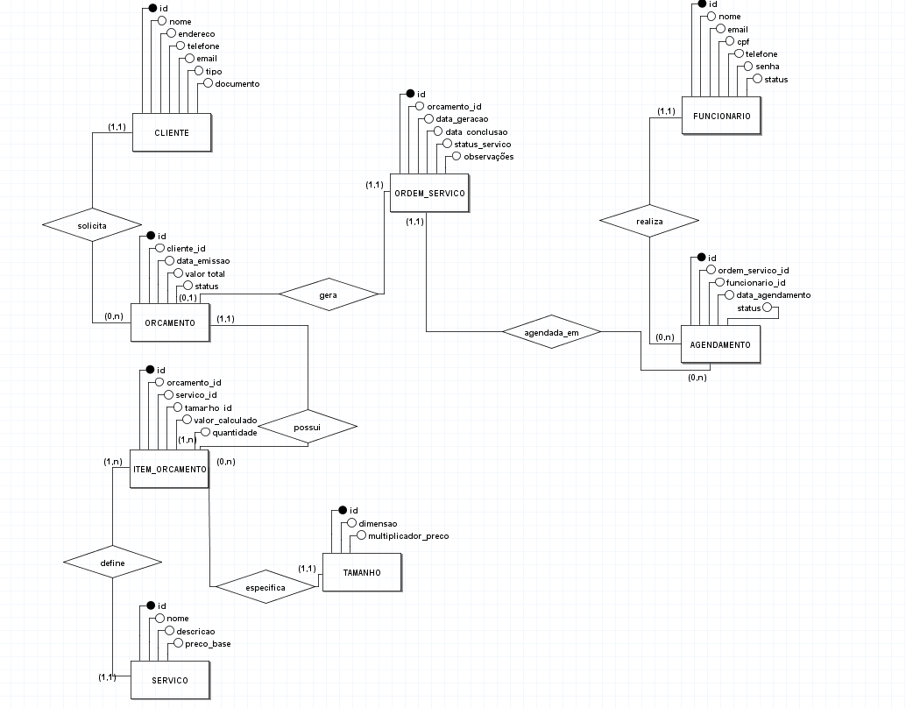
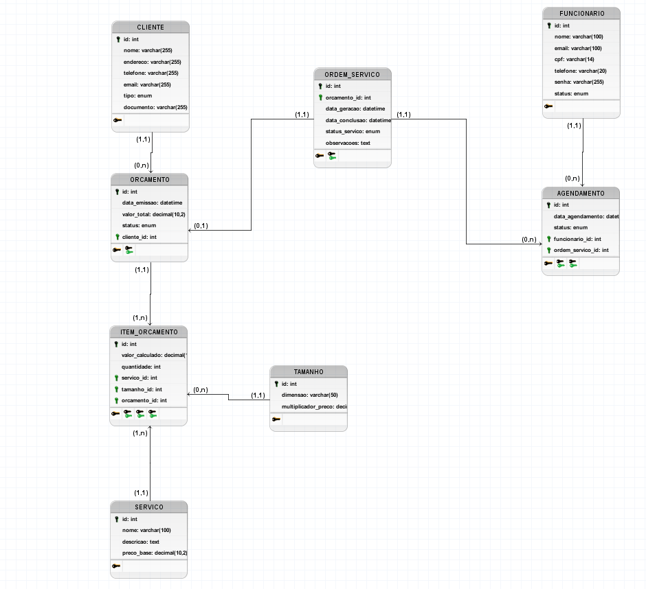

# MODELO CONCEITUAL

# MODELO LÓGICO

# DICIONARIO DE DADOS

## Procedures

| **Nome do Procedimento**     | **Parâmetros de Entrada** | **Ação Principal**      | **Descrição Detalhada** |
|------------------------------|---------------------------|--------------------------|---------------------------|
| **sp_cancelar_orcamento**    | `p_id (INT)`              | UPDATE (Soft Delete)     | Verifica se o orçamento já é uma venda ('Aprovado'). Se não for, altera o status para 'Cancelado'. Retorna erro se tentar cancelar venda fechada. |
| **sp_cancelar_agendamento**  | `p_agendamento_id (INT)`  | UPDATE (Soft Delete)     | Altera o status do Agendamento para 'Cancelado' e automaticamente busca a OS vinculada e também a define como 'Cancelada'. |
| **sp_concluir_os**           | `p_os_id (INT)`           | UPDATE (Cascata)         | Finaliza o ciclo do serviço. Define a OS como 'Concluído', preenche a data_conclusao com a hora atual e marca o agendamento vinculado como 'Concluído'. |

## Trigger

| **Nome do Objeto**              | **Tipo**   | **Evento / Retorno**               | **Descrição da Regra** |
|----------------------------------|-----------|------------------------------------|-------------------------|
| **trg_verificar_data_agendamento** | TRIGGER   | BEFORE INSERT (agendamento)        | Trava de Segurança: Antes de gravar um agendamento, verifica se a data é menor que NOW(). Se for data passada, bloqueia e exibe mensagem de erro. |
